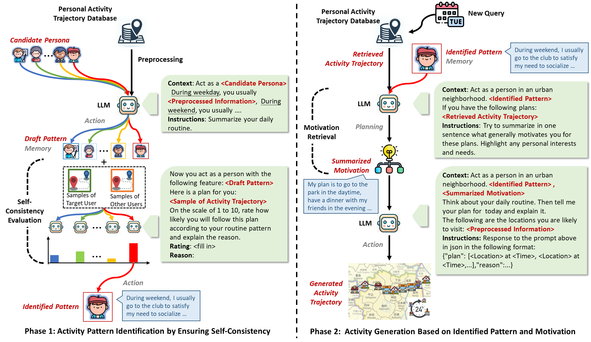
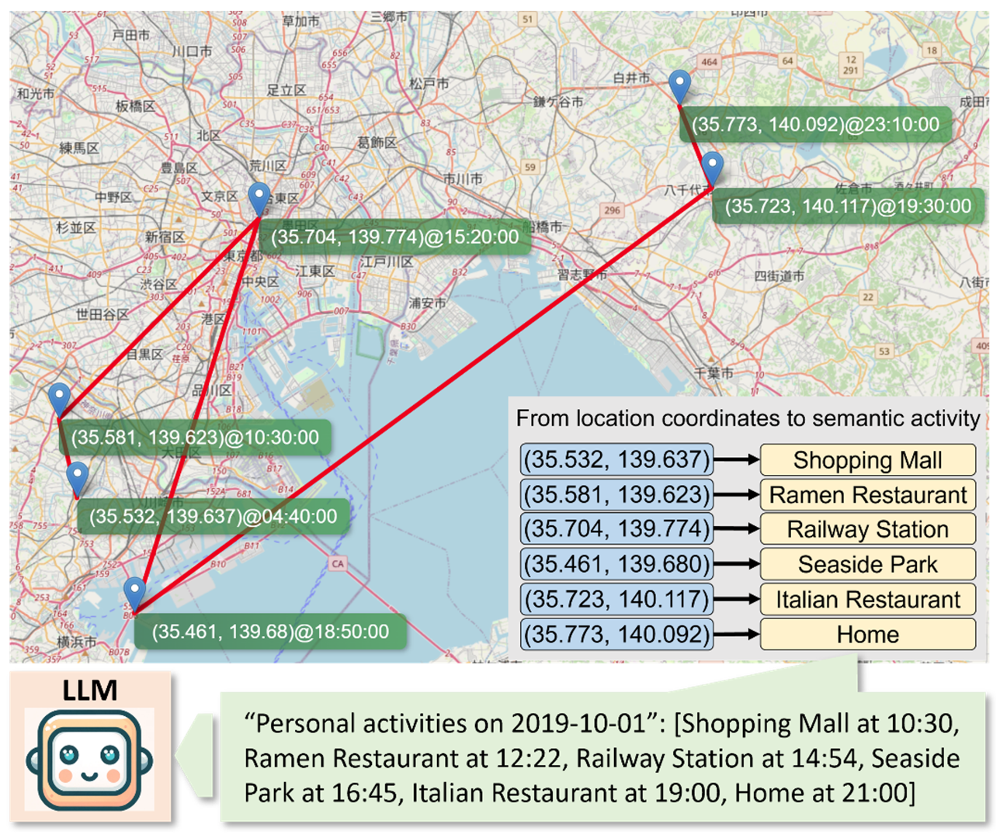

<a href='https://arxiv.org/abs/2304.04370'></a> 
[](https://github.com/agiresearch/OpenAGI/blob/main/LICENSE)


# (NeurIPS' 24) Large Language Models as Urban Residents: An LLM Agent Framework for Personal Mobility Generation

## 📖 Description
Welcome to the official implementation of **LLMob**, as described in our paper *[Large Language Models as Urban Residents: An LLM Agent Framework for Personal Mobility Generation](https://arxiv.org/abs/2402.14744)*. This project demonstrates how Large Language Models (LLMs) can be leveraged to generate personal mobility trajectories based on real-world data.
 
LLMob is an intuitive framework that builds reasoning logic for LLMs in the context of personal activity trajectory generation.

<p align="center">

  <br>
  <em>Figure 1: The LLMob Framework Architecture.</em>
</p>

<p align="center">

  <br>
  <em>Figure 2: Illustration of activity trajectory generated by LLM agent.</em>
</p>


## ⭐ Key Components
- **./simulator/engine/person.py**: Generate personal activity trajectory according to real-world check-in data.
- **./simulator/engine/functions/traj_infer.py**: Personal activity trajectory generation function.
- **./simulator/engine/functions/PISC.py**: Personal activity pattern identification function.
- **./simulator/engine/memory/retrieval_helper.py**: Function related to motivation retrieval.
- **./simulator/prompt_template**: Prompt template used in this project.

## ⚙️ Usage

To get started with LLMob, follow these steps:

```bash
git clone https://github.com/Wangjw6/LLMob.git
cd LLMob
conda env create -f environment.yml
conda activate llm
python run_anonymized.py 
```
You should also add your own OpenAI API key in the `./config/key.yaml` file.

## 📚 BibTex Citation

If you would like to cite our code or paper, please use:

```
@article{wang2024large,
  title={Large language models as urban residents: An llm agent framework for personal mobility generation},
  author={Wang, Jiawei and Jiang, Renhe and Yang, Chuang and Wu, Zengqing and Onizuka, Makoto and Shibasaki, Ryosuke, Noboru Koshizuka and Xiao, Chuan},
  journal={arXiv preprint arXiv:2402.14744},
  year={2024}
}
```

## 🌷 Acknowledgments
Our implementation adapts several open-source ChatGPT application and have extensively modified it to our purposes. We thank the authors for sharing their implementations and related resources:

- [Generative Agents: Interactive Simulacra of Human Behavior](https://github.com/joonspk-research/generative_agents)

- [MetaGPT](https://github.com/geekan/MetaGPT/tree/main)

The raw data used in this project is from [Foursquare API](https://location.foursquare.com/developer/). 
We select the data with enough records and preprocess them before using in our project.
